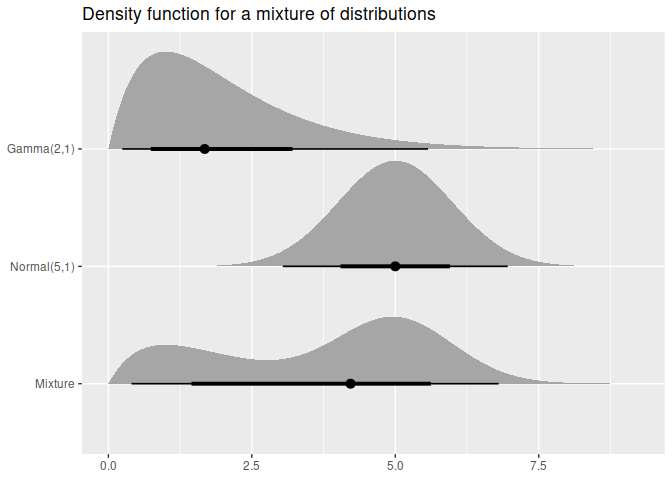
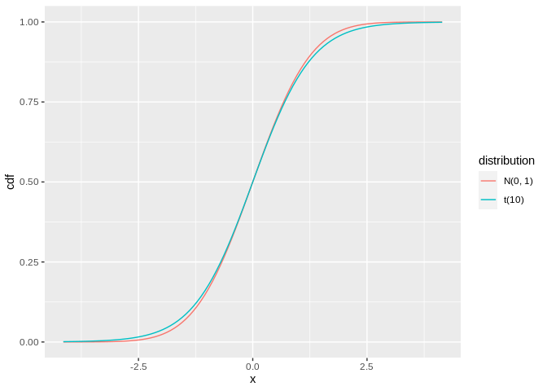

<!-- README.md is generated from README.Rmd. Please edit that file -->

# distributional

<!-- badges: start -->

[](https://www.tidyverse.org/lifecycle/#experimental)
[](https://github.com/mitchelloharawild/distributional)
[](https://codecov.io/github/mitchelloharawild/distributional?branch=master)
[](https://CRAN.R-project.org/package=distributional)
<!-- badges: end -->

The distributional package allows distributions to be used in a
vectorised context. It provides methods which are minimal wrappers to
the standard d, p, q, and r distribution functions which are applied to
each distribution in the vector. Additional distributional statistics
can be computed, including the `mean()`, `median()`, `variance()`, and
intervals with `hilo()`.

The distributional nature of a model’s predictions is often understated,
with defaults of `predict()` methods usually only producing point
predictions. The `forecast()` function from the [forecast
package](https://CRAN.R-project.org/package=forecast) goes further in
illustrating uncertainty by producing point forecasts and intervals by
default, however the user’s ability to interact with them is limited.
This package vectorises distributions and provides methods for working
with them, making entire distributions suitable prediction outputs for
model functions.

## Installation

You can install the released version of distributional from
[CRAN](https://CRAN.R-project.org/package=distributional) with:

``` r
install.packages("distributional")
```

The development version can be installed from
[GitHub](https://github.com/mitchelloharawild/distributional) with:

``` r
# install.packages("remotes")
remotes::install_github("mitchelloharawild/distributional")
```

## Examples

Distributions are created using `dist_*()` functions. Currently only the
normal distribution is supported for testing purposes.

``` r
library(distributional)
my_dist <- c(dist_normal(mu = 0, sigma = 1), dist_student_t(df = 10))
my_dist
#> <distribution[2]>
#> [1] N(0, 1) t(10)
```

The standard four distribution functions in R are usable via these
generics:

``` r
density(my_dist, 0) # c(dnorm(0, mean = 0, sd = 1), dt(0, df = 10))
#> [1] 0.3989423 0.3891084
cdf(my_dist, 5) # c(pnorm(5, mean = 0, sd = 1), pt(5, df = 10))
#> [1] 0.9999997 0.9997313
quantile(my_dist, 0.1) # c(qnorm(0.1, mean = 0, sd = 1), qt(0.1, df = 10))
#> [1] -1.281552 -1.372184
generate(my_dist, 10) # list(rnorm(10, mean = 0, sd = 1), rt(10, df = 10))
#> [[1]]
#>  [1]  1.262954285 -0.326233361  1.329799263  1.272429321  0.414641434
#>  [6] -1.539950042 -0.928567035 -0.294720447 -0.005767173  2.404653389
#> 
#> [[2]]
#>  [1]  0.99165484 -1.36999677 -0.40943004 -0.85261144 -1.37728388  0.81020460
#>  [7] -1.82965813 -0.06142032 -1.33933588 -0.28491414
```

You can also compute intervals using `hilo()`

``` r
hilo(my_dist, 0.95)
#> <hilo[2]>
#> [1] [-0.01190677, 0.01190677]0.95 [-0.01220773, 0.01220773]0.95
```

Additionally, some distributions may support other methods such as
mathematical operations and summary measures. If the methods aren’t
supported, a transformed distribution will be created.

``` r
my_dist
#> <distribution[2]>
#> [1] N(0, 1) t(10)
my_dist*3 + 2
#> <distribution[2]>
#> [1] N(2, 9)  t(t(10))
mean(my_dist)
#> [1] 0 0
variance(my_dist)
#> [1] 1.00 1.25
```

You can also visualise the distribution(s) using `autoplot()`.

``` r
library(ggplot2)
autoplot(my_dist, type = "pdf")
```



``` r
autoplot(my_dist, type = "cdf")
```



## Related work

There are several packages which unify interfaces for distributions in
R:

  - stats provides functions to work with possibly multiple
    distributions (comparisons made below).
  - [distributions3](https://cran.r-project.org/package=distributions3)
    represents singular distributions using S3, with particularly nice
    documentation.
  - [distr](https://cran.r-project.org/package=distr) represents
    singular distributions using S4.
  - [distr6](https://cran.r-project.org/package=distr6) represents
    singular distributions using R6.
  - Many more in the [CRAN task
    view](https://cran.r-project.org/view=Distributions)

This package differs from the above libraries by storing the
distributions in a vectorised format. It does this using
[vctrs](https://vctrs.r-lib.org/), so it should play nicely with the
tidyverse (try putting distributions into a tibble\!).
